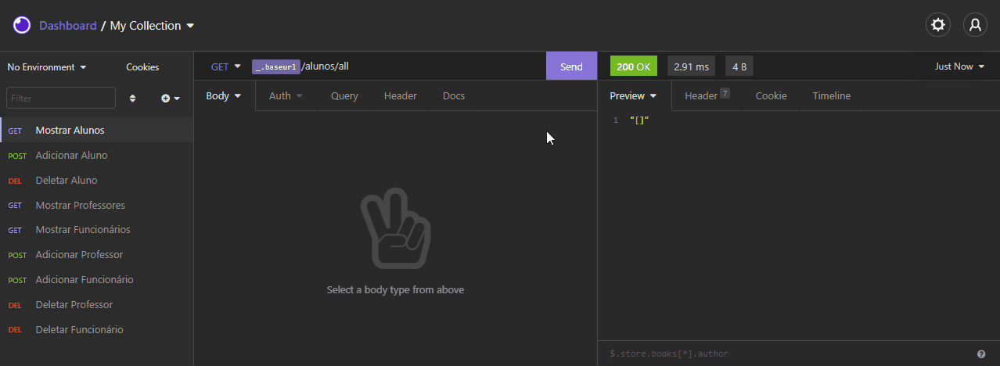

 

    

  <h3 align="center">API para Sistema de Gerenciamento Escolar</h3>
 
 

  <a href="#sobre"> Sobre </a> |
  <a href="#rotas-da-aplicação"> Rotas da aplicação </a> |
  <a href="#techs"> Techs </a>

#
<h1 align="center">
    
 </h1>
 

# Sobre
A ideia do projeto foi criar uma API de sistema de gerenciamento escolar onde é possível ver a lista, adicionar ou remover alunos, professores e funcionários de uma escola com a finalidade de colocar em prática os conhecimentos iniciais em Node.js e Express que tenho atualmente!

# Rotas da aplicação:
Alunos, professores e funcionários possuem rotas diferentes onde:   
/alunos => Rota refente aos alunos.  
/professores => Rota referente aos professores.  
/funcionarios => Rota referente aos funcionários.  

Para cada rota acima, é possível listar, adicionar ou remover um aluno/professor/funcináorio:

<b>[GET] </b> -> /**/all : A rota deverá listar todos os alunos, professores ou funcionários cadastrados. 

<b>[POST] </b> -> /**/new :  A rota deverá adicionar um novo aluno, professor ou funcionário.   
 -> Ao cadastrar um novo aluno, a rota deverá receber nome(name) e nota(score) dentro de um objeto JSON no corpo da requisição. O dado deverá ser armazedo dentro de um objeto com o seguinte formato: {name: 'nomeDoAluno', score: 10}.  
 -> Ao cadastrar um novo professor, a rota deverá receber nome(name) e matéria(subject) dentro de um objeto JSON no corpo da requisição. O dado deverá ser armazedo dentro de um objeto com o seguinte formato: {name: 'nomeDoProfessor', subject: 'nomeDaMatéria'}.   
 -> Ao cadastrar um novo funcionário, a rota deverá receber nome(name) e função(role) dentro de um objeto JSON no corpo da requisição. O dado deverá ser armazedo dentro de um objeto com o seguinte formato: {name: 'nomeDoProfessor', role: 'nomeDaFunção'}.  

<b>[DELETE] </b> -> /**/delete : A rota deverá deletar a obra com o id presente dentro de um objeto JSON no corpo da requisição.  

Obs: /** -> Rota refente ao grupo a ser acessado.

# Techs: 
- Node.JS
- Express.JS

---

 **Desenvolvido  por [Bruno Andreotti](https://github.com/brunoandreotti).** 
